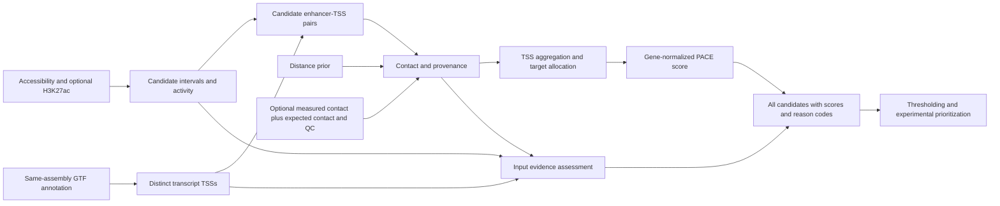

# PACE (Prediction of Activity-based regulatory Connections for Enhancers)

**Enhancer–gene prediction from chromatin activity, contact evidence and promoter annotation, with explicit reporting of missing information.**

Author and maintainer: **shenlinyong — 申林用 (Linyong Shen), Northwest A&F University**.

[Install](docs/INSTALLATION.md) · [Quick start](docs/QUICKSTART.md) · [Tutorial](docs/TUTORIAL.md) · [Parameters](docs/PARAMETERS.md) · [中文说明](docs/README_zh.md)

## What does PACE do?

PACE ranks candidate cis-regulatory links for one species, genome assembly and tissue or cell type at a time. It combines enhancer activity with promoter contact, integrates distinct transcription start sites (TSSs), and reports a relative score alongside the completeness and quality of the supporting inputs. It accepts prepared numerical tables or genomic signal files; neither a training-label set nor a GPU is required.

The workflow is designed for studies in which livestock tissues have uneven assay coverage, limited matched Hi-C data and incomplete promoter annotation. Pig, cattle and chicken analyses motivate these choices. Other species can be processed with matching reference files; performance in a new species or tissue needs independent evaluation.

**The output is a ranked set of candidates for follow-up. A PACE score is not a probability of regulation or a calibrated false discovery rate.**

## How does it differ from the original ABC model?

The reference is the **Activity-by-Contact (ABC) model of Fulco et al. (2019)**, which scores an element using its activity–contact product relative to competing elements around a gene. See the [original paper](https://doi.org/10.1038/s41588-019-0538-0) and [NG2019 implementation](https://github.com/EngreitzLab/ABC-Enhancer-Gene-Prediction-20250314-archive/tree/NG2019). Later ABC releases have additional features and should be identified separately in benchmarks.

| Component | Original ABC reference | PACE implementation | Purpose in livestock studies |
| --- | --- | --- | --- |
| Activity | Geometric combination of accessibility and H3K27ac in the original profile | Scaled, shifted geometric aggregation with explicit missing values and optional measurement quality | Retain an available assay without treating an unmeasured assay as zero |
| Contact | Measured contact; averaged contact and distance alternatives were already available | Blend observed/expected contact with a distance prior using supplied reliability; record matched, surrogate or prior-only provenance | Use limited contact data while keeping tissue mismatch and missing QC visible |
| Promoters | Gene annotation supplies the promoter used for scoring | Deduplicate transcript TSSs and combine them with weights summing to one per gene | Represent alternative promoters without rewarding duplicate transcript records |
| Candidate targets | Gene-centred normalization of activity × contact | Add enhancer-centred target allocation before gene normalization | Account for an enhancer having multiple candidate target genes |
| Evidence reporting | ABC score and input/output annotations | Separate activity, contact, TSS and catalogue quality; retain unscorable candidates | Make sparse evidence visible when selecting candidates for experiments |

The target-allocation and multiple-TSS principles draw on [generalized ABC / STARE](https://doi.org/10.1093/bioinformatics/btad062); PACE uses a weighted-average TSS implementation. These are attributed extensions, not claims that every component is new. [The full comparison](docs/ABC_COMPARISON.md) explains the rationale, unchanged settings and limitations.

For enhancer $E$ and gene $G$, the score is

$$
\mathit{PACE}(E,G)=\frac{A(E)C(E,G)B(E,G)^\eta}{\sum_{e\in\mathcal E^{\mathrm{obs}}(G)}A(e)C(e,G)B(e,G)^\eta+U(G)}.
$$

Here, **A** is activity, **C** is TSS-weighted contact, **B** allocates contact across an enhancer's candidate genes, and **U** is optional, independently estimated residual support. The defaults are $\eta=1$ and unknown $U$, computationally zero and explicitly flagged. RNA can annotate expression context; it is not a multiplicative score weight. [Equations](docs/FORMULA.md) · [Every parameter and its rationale](docs/PARAMETERS.md)

## Workflow



## Install with Conda

Prerequisites: **Linux, Bash, Git and Conda** (for example, [Miniforge](https://github.com/conda-forge/miniforge)). The commands below install Python and all dependencies for the documented direct workflows and tests; packages do not need to be installed one by one.

```bash
git clone https://github.com/shenlinyong/PACE.git
cd PACE
CONDA_CHANNEL_PRIORITY=strict conda env create -f environment.yml
conda activate pace
python scripts/pace.py --help
bedtools --version
```

The environment contains Python 3.11, NumPy, pandas, PyYAML, SciPy, matplotlib, pyBigWig, bedtools, samtools and pytest. MACS2 and Snakemake are needed only for the optional peak-calling workflow. `.hic` and `.cool` readers have separate optional dependencies. See [installation and package roles](docs/INSTALLATION.md), including environment export and troubleshooting.

## Run your first example

All commands assume the repository root and an activated environment.

### 1. Prepared numerical inputs

```bash
python scripts/pace.py \
  --pairs example_quantified/candidates.tsv \
  --activity-config example_quantified/activity.json \
  --output results/quickstart/predictions.tsv
```

Expected console output:

```text
Wrote 6 gene-level edges; all scores are uncalibrated.
```

The nine input enhancer–TSS rows collapse to six enhancer–gene rows. Two rows deliberately remain unscored because their activity is missing. Inspect the main output fields:

```bash
python - <<'PYCODE'
import pandas as pd
p = pd.read_csv('results/quickstart/predictions.tsv', sep='\t')
print(p[['TargetGeneEnsemblID', 'start', 'PACE.Score',
         'contact_state', 'evidence_status']].to_string(index=False))
PYCODE
```

### 2. Bundled genomic-read example

```bash
bash example/run_example_direct.sh
```

This runs candidate construction, signal quantification, scoring, filtering and QC on supplied synthetic reads. Outputs are written to `example/results/Example_Sample/`; the complete prediction table contains **12,000 enhancer–gene pairs**. The [tutorial](docs/TUTORIAL.md) explains each command and how to replace the inputs with a livestock sample.

### 3. Check your installation

```bash
python -m pytest tests -q
python scripts/smoke_test.py --output-dir results/smoke
```

The smoke workflow checks eight commands, including measured zero versus missing contact and agreement with an independent formula calculation. The examples are software fixtures, not biological validation datasets. See [validation scope](VALIDATION.md).

## What data do I need?

| Starting point | Required inputs | Optional inputs | Entry point |
| --- | --- | --- | --- |
| Prepared candidate table | Enhancer coordinates, stable gene ID, TSS, positive contact prior, and activity or named signal columns | Contact observations/expectations/QC, TSS weights, evidence quality | `scripts/pace.py` |
| Called peaks and genomic signals | Candidate BED or narrowPeak, chromosome sizes, same-assembly GTF/TSS catalogue, accessibility signal | H3K27ac, RNA context, measured contacts with QC | Direct commands in the [tutorial](docs/TUTORIAL.md) |
| Aligned accessibility reads | BAM/tagAlign, reference files, sample sheet and YAML configuration | H3K27ac and qualified contact inputs | Optional [Snakemake workflow](docs/TUTORIAL.md#optional-snakemake-workflow) |

Use one assembly throughout. Genomic tables use zero-based, half-open intervals; `prepare_tss.py` converts GTF coordinates. Use `NA` for missing measurements and `0` for measured zero. PACE does not perform FASTQ alignment, peak replication assessment, genome liftover or automatic Hi-C expected-curve/QC estimation.

## Read the results

The **unfiltered table** is the primary record. Keep it when reporting results or benchmarking; score filtering must not redefine the normalization background.

| Output | Meaning |
| --- | --- |
| `PACE.Score` | Relative support within the supplied candidate set |
| `contact_gene`, `target_share`, `raw_support` | Components of the score |
| `TargetGeneTSSs`, `n_tss` | Contributing TSS alternatives |
| `contact_state` | Whether contact is prior-only, matched, surrogate or unusable without further QC |
| `evidence_status`, `evidence_reasons` | Input sufficiency and reasons for limitations |
| `score_scope`, `unscored_candidates` | Residual-support status and missing candidates within the supplied gene background |

`provisional` is expected for distance-only runs or missing quality information. `sufficient_input_evidence` does not establish functional validation. The illustrative score cutoff **0.02** requires calibration before decision use in a new species or tissue. [Complete field definitions and examples](docs/IO_FORMATS.md)

## User manual

| Guide | Contents |
| --- | --- |
| [Installation](docs/INSTALLATION.md) | Prerequisites, package roles, Conda environments, optional readers |
| [Quick start](docs/QUICKSTART.md) | Reproducible first run and expected outputs |
| [Tutorial](docs/TUTORIAL.md) | Real-sample preparation, direct commands, contacts, filtering and Snakemake |
| [ABC comparison](docs/ABC_COMPARISON.md) | What changes, why it changes and relevance to livestock data |
| [Parameters](docs/PARAMETERS.md) | Defaults, actual control points, rationale and calibration needs |
| [Input specification](docs/INPUTS.md) | Table schemas, sample sheets and missing-value rules |
| [Output specification](docs/IO_FORMATS.md) | Scores, evidence states, diagnostic fields and files |
| [Equations](docs/FORMULA.md) | Scoring, QC and limiting cases |
| [Troubleshooting](docs/TROUBLESHOOTING.md) | Installation and common data errors |
| [中文说明](docs/README_zh.md) | 中文安装、模型比较与使用导览 |

## Citation, support and licence

For PACE, cite the repository and the exact commit used; a PACE publication DOI is not assigned in this repository. Method sources include Fulco et al., *Nature Genetics* (2019), [doi:10.1038/s41588-019-0538-0](https://doi.org/10.1038/s41588-019-0538-0), and Hecker et al., *Bioinformatics* (2023), [doi:10.1093/bioinformatics/btad062](https://doi.org/10.1093/bioinformatics/btad062).

Report problems through [GitHub Issues](https://github.com/shenlinyong/PACE/issues), with the commit, command, environment and a small reproducible input. PACE is distributed under the [MIT licence](LICENSE); third-party attribution is retained in [AUTHORS.md](AUTHORS.md).
